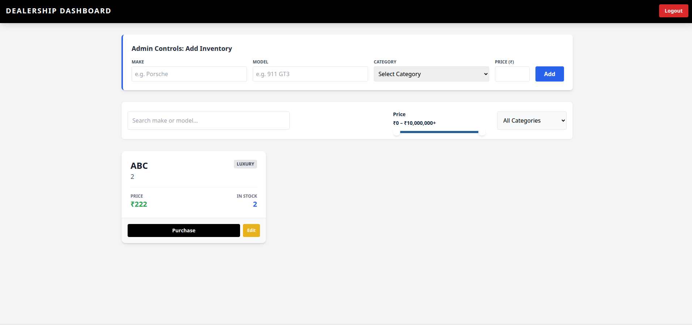
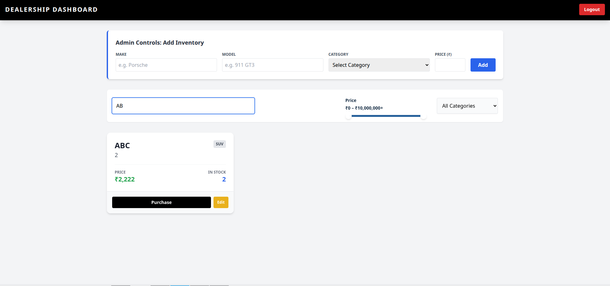
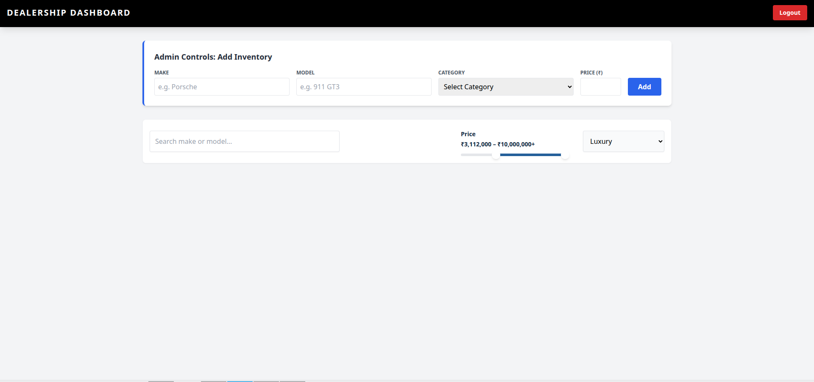
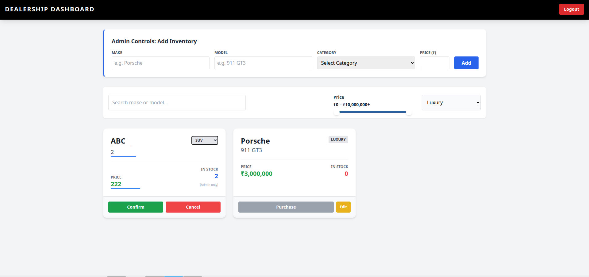
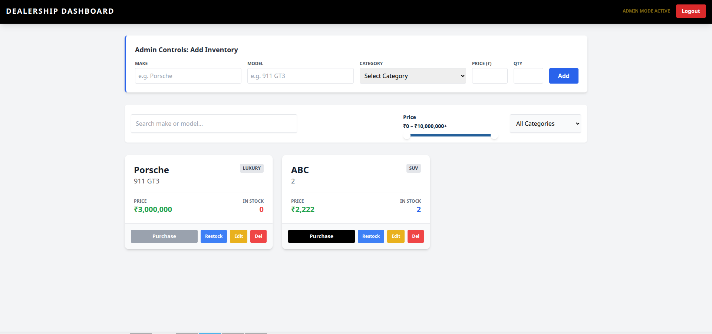
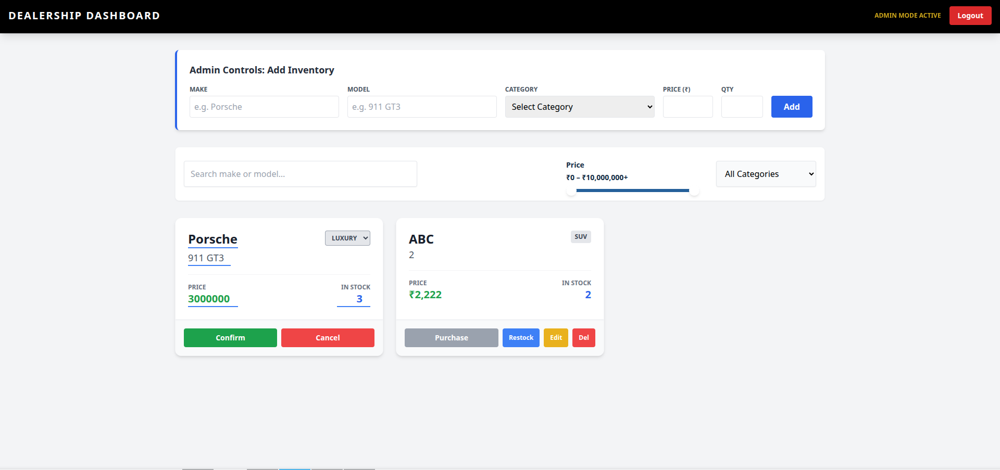
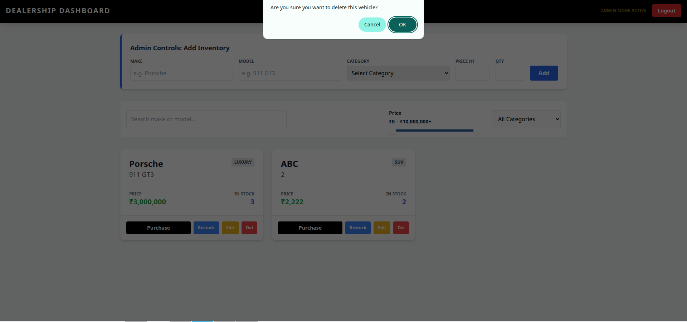
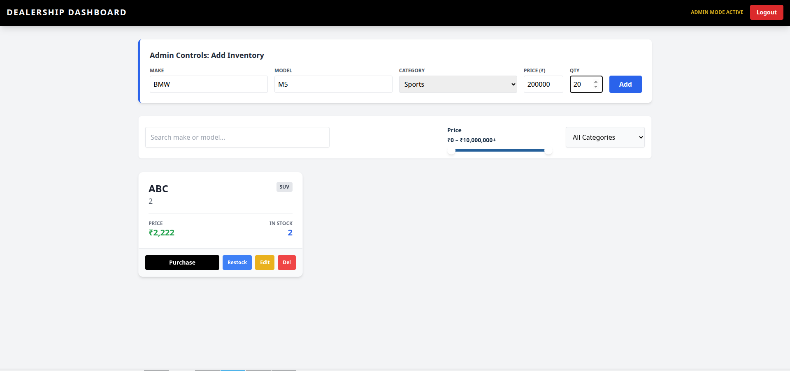

# Car Dealership Inventory System 🚗

A full-stack, single-page application (SPA) and RESTful API built to manage a car dealership's inventory. This project was developed following Test-Driven Development (TDD) principles as part of a comprehensive software engineering Kata.

## 📖 Project Overview

This system allows users to view, search, and purchase vehicles from a live inventory, while providing administrative users with tools to manage that inventory. It features a robust FastAPI backend connected to a PostgreSQL database, paired with a responsive React frontend styled with Tailwind CSS.

### Key Features
*   **Role-Based Access Control (RBAC):** Secure JWT authentication distinguishing between Standard Users and Administrators.
*   **Inventory Management:** 
    *   *Admins:* Can add new vehicles, restock quantities, update vehicle details, and delete records.
    *   *Users:* Can browse, search, edit vehicle details (excluding stock quantity), and "purchase" vehicles (which decreases stock).
*   **Smart Search & Filtering:** Filter vehicles by make, model, category, and a dynamic price range slider.
*   **Validation & Security:** Backend validation via Pydantic (preventing negative prices/quantities) and route-level dependency injection to secure admin-only actions.

## 🛠️ Tech Stack

**Backend:**
*   Python 3.x
*   FastAPI (REST API framework)
*   SQLAlchemy & PostgreSQL (Database & ORM)
*   Pytest & Pytest-cov (Testing)
*   Python-JOSE & Passlib (JWT Authentication & Password Hashing)

**Frontend:**
*   React 19 (via Vite)
*   Tailwind CSS (Styling)
*   Vitest & React Testing Library (Testing)

---

## 📸 Screenshots


### Homepage

*The landing page for the Car Dealership application.*

### Standard User Experience

*The main inventory dashboard from a standard user's perspective.*


*Standard user filtering the inventory using the text search for vehicle Make or Model.*


*Standard user filtering the inventory using the dynamic price range slider and category dropdown.*


*Standard user adding a new vehicle to the inventory system.*


*Standard user updating vehicle details. Notice the stock quantity remains safely read-only.*

### Administrator Controls

*The inventory dashboard from an Administrator's perspective, featuring full CRUD controls (Restock, Edit, Delete).*


*Admin editing vehicle details, including full access to modify the actual stock quantity.*


*Admin initiating a vehicle deletion with a browser confirmation prompt to prevent accidental data loss.*


*The Admin dashboard seamlessly reflecting the updated inventory after a successful deletion.*

---

## 🚀 Local Setup Instructions

### Prerequisites
*   Node.js (v18+)
*   Python (3.10+)
*   PostgreSQL running locally

### 1. Backend Setup (FastAPI)

1. Clone the repository and navigate to the project root:
   ```bash
   git clone <your-repo-url>
   cd kata_dealership

```

2. Create and activate a virtual environment:
```bash
python -m venv .venv
source .venv/bin/activate  # On Windows use: .venv\Scripts\activate

```


3. Install backend dependencies:
```bash
pip install fastapi uvicorn sqlalchemy psycopg2-binary python-jose[cryptography] passlib[bcrypt] pydantic

```


*(Note: Adjust this to `pip install -r requirements.txt` if you have exported one).*
4. Configure your database connection in `app/database.py` or your `.env` file to point to your local PostgreSQL instance.
5. Start the backend server:
```bash
uvicorn app.main:app --reload

```


*The API will be available at `http://localhost:8000*`

### 2. Frontend Setup (React)

1. Open a new terminal tab and navigate to the frontend directory:
```bash
cd frontend

```


2. Install frontend dependencies:
```bash
npm install

```


3. Start the Vite development server:
```bash
npm run dev

```


*The application will be available at `http://localhost:5173*`

---

## 🧪 Testing

This project adheres to TDD practices. To run the test suites locally:

**Backend Tests:**
Ensure your virtual environment is active, then run:

```bash
pip install pytest pytest-cov
pytest -v --cov=app

```

**Frontend Tests:**
Navigate to the `frontend` directory and run:

```bash
npm run test -- --reporter verbose

```

---

## 🤖 My AI Usage

**AI Tool Used:** Gemini

**How I used it:**
I utilized Gemini primarily as a pair-programmer for debugging, environment configuration, and test suite setup. Specific instances include:

* **Debugging masked CORS errors:** Gemini helped me diagnose that a frontend CORS error was actually being caused by a backend `500 Internal Server Error` triggered by an `AttributeError` in my FastAPI dependency injection (`current_user`).
* **Role-Based Access Control (RBAC) UI:** I used AI to help structure the React conditional rendering for standard users vs. admins, specifically ensuring standard users could edit vehicle details without modifying the stock quantity.
* **Test Suite Configuration:** I used Gemini to troubleshoot missing Python dependencies (`python-jose`, `pytest-cov`) and to correctly configure Vitest with a `jsdom` environment for the React frontend.
* **Fixing Database Fixtures:** We worked together to resolve an SQLAlchemy `IntegrityError` in my pytest suite by updating the database fixture to check for existing users before inserting, preventing unique constraint violations.

**Reflection:**
Using AI significantly sped up the debugging process, especially when dealing with misleading error messages (like the fake CORS error). It acted as a highly effective sounding board that helped me pinpoint syntax errors and configuration gaps much faster than I would have by manually digging through documentation.


